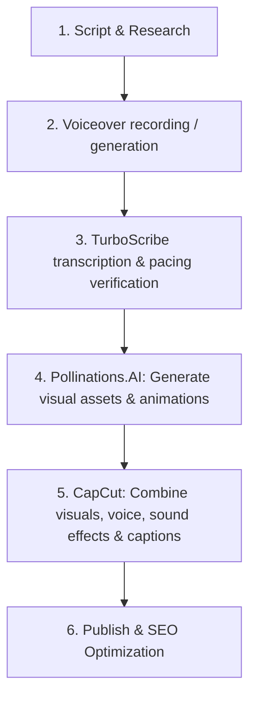

# YouTube Channel Strategy: Educational & Curiosities

This document outlines the branding, workflow, and long-term monetization plan for your new YouTube channel, customized for your tool stack: **Pollinations.AI**, **CapCut**, and **TurboScribe**.

---

## 1. Channel Identity & Niche

* **Niche**: Accessible Educational Documentaries & Global Curiosities.
* **Core Style**: Engaging, visual-rich stories about science, history, geography, and global systems, delivered with a calm, clear voice and subtle, clever humor. (Think: A blend of *Vox* design, *Kurzgesagt* curiosity, and *Johnny Harris* narrative pacing).
* **Target Audience**: General public (curious minds of all ages, from school kids to seniors).
* **Proposed Channel Names**:
  1. **Atlas & Archive** (Sounds authoritative, storytelling-focused)
  2. **The Global Curio** (Intriguing, friendly)
  3. **How It Stands** (Direct, educational)
  4. **Terra Cognita** (Deep, intellectual)

---

## 2. Production Workflow (Your Tool Stack)

Using your current setup, we can optimize the workflow for speed and premium quality:

### Step-by-Step Production Guide

1. **Voiceover & Pacing**:
   - Write scripts designed for a calm reading pace of **130-140 words per minute**.
   - If recording yourself: Use a standard microphone, speak slowly, and leave gaps between key points.
   - Run the audio through **TurboScribe** to get an accurate transcription. You can use this transcription to create dynamic closed captions in CapCut or double-check script timings.

2. **Visual Generation with Pollinations.AI**:
   - Use Pollinations.AI to generate premium, stylized B-roll. Since it supports a variety of image-generation models, use it for scenes that are hard to find on stock sites (e.g., "A seed vault deep inside an icy Norwegian mountain, cinematic lighting, photorealistic").
   - Define a consistent visual style (e.g., cinematic realistic or highly stylized vectors) to keep the channel cohesive.

3. **Editing in CapCut**:
   - Import the voiceover and Pollinations.AI clips.
   - Set the video frame rate to **24fps** or **30fps** for a cinematic look.
   - Use CapCut's **Auto Captions** feature, styling the captions in a clean, legible font (like Montserrat or Inter) with high contrast.
   - Add a subtle background music track (low volume, e.g., -20dB to -25dB) that matches the mood (inspirational, ambient, slightly playful).

---

## 3. Monetization Strategy

To reach monetization as quickly and sustainably as possible, we target three streams:

1. **AdSense (YouTube Partner Program)**:
   - Educational content generally has a healthy CPM (Cost Per Mille / views) because advertisers love targeting curious, engaged demographics.
   - Focus on longer videos (8+ minutes) to allow mid-roll ads once monetized.
2. **Affiliate & Partner Links**:
   - Highlight tools, books, or services mentioned in the video in the description.
3. **Sponsorships**:
   - Educational channels are highly attractive to brands like CuriosityStream, Brilliant.org, NordVPN, and language-learning apps.
